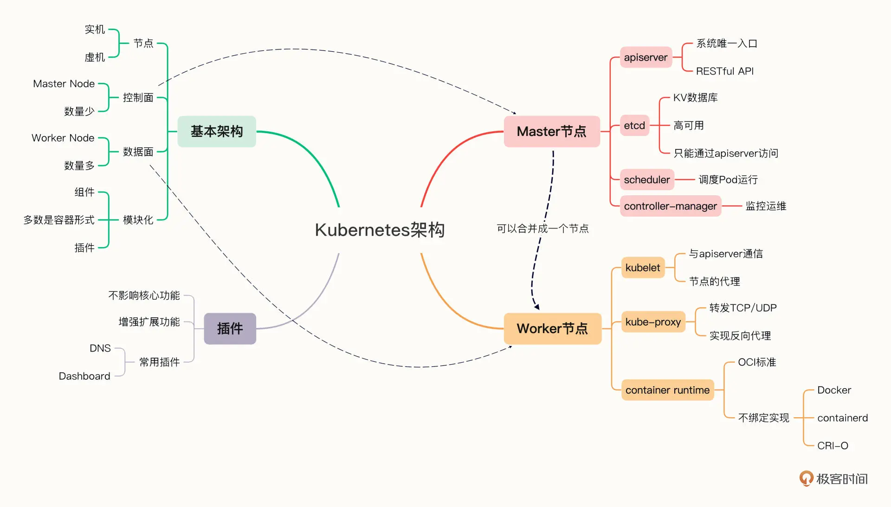

# Docker

## 镜像
静态，包含应用软件本身以及运行所需的一切环境配置与依赖性，打包成为一个镜像文件

## 容器
从镜像仓库中拉取并且在单独沙盒环境中运行的动态实例，本身也是一个系统内的具体进程

## docker engine和docker daemon
负责调度、管理镜像与容器

## docker hub
类似github，作为一个仓库，存储了大量官方和个人的镜像

## docker操作命令 

| 指令 | 描述 |
| ---- | ---- |
| `docker rm/rmi` | rm-删除容器/rmi-删除镜像 |
| `docker run` | 启动容器，参数较多 |
| `docker exec` | 使用容器运行相关命令 |
| `docker ps` | 列举容器 |
| `docker cp` | 在容器内外传输文件 |
| `docker build -f makeFile .` | 打包镜像命令 |
| `docker pull/push` | 拉取和推送镜像 |

## docker的相关设计
1. 容器内外的文件复制，可以使用 `docker cp` 命令，类似Linux的 cp命令
2. 容器内外的文件共享，可以在`docker run` 时候添加 `-v` 操作指定容器和宿主机的共享目录
3. 容器内外的网络传输，
	1. null模式，不需要网络交互的场景
	2. host模式，代表容器和宿主共享网络
	3. Bridge模式，也是docker默认的模式，提供虚拟桥接进行映射。一般在容器启动时提供 `docker run -p` 指定容器内的端口映射到宿主机的端口

## 虚拟化技术的对比
1. 容器技术，通过namespace、cgroup、chroot等技术使用宿主机的硬件来隔离出独立的环境。轻量级，本身也是一个普通后台进程，更适合现在大规模的微服务后端架构
2. 虚拟机技术，通过虚拟机软件来分割宿主机并模拟计算机硬件，在此之上构建系统再来运行对应软件

# k8s
## k8s的一般架构

## k8s要解决的问题痛点
1. 单个或者几个容器应用可以考虑手动或者编写脚本来完成日常的部署维护操作。但是针对现在微服务架构下的庞大实例集群来说，需要一个新的解决方案来对微服务集群进行回滚、升级、扩容、缩容、自动纠错等操作，即所谓的容器编排技术。
2. 要解决的核心问题是：这些容器之上的管理、调度工作，就是这些年最流行的词汇：“容器编排”（Container Orchestration）。

## k8s是什么
Kubernetes 就是一个生产级别的容器编排平台和集群管理系统，不仅能够创建、调度容器，还能够监控、管理海量的服务器。

## k8s和docker的差异
docker是一个较为底层，将应用进行打包、测试、部署的一体化运行软件。k8s基于docker,将所有集群运行时的容器、kata、containerd等抽象成统一的模型，并提供统一接口访问。k8s只是流行最广的一种容器编排应用软件，就相当于spring是应用最广的javaWeb架构一样。

## k8s的架构
k8s的简单架构可以参考下面图例：

1. Master Node
	1. API Server，系统入口，提供各组件间的API操作
	2. etcd，K-V数据库，提供持久化
	3. Controller Manager，负责维护容器和节点的资源状态。提供故障检测、服务迁移、应用伸缩等功能
	4. kube scheduler，负责容器编排，检查资源状态。
2. Worker Node
	1. kubelet，node的代理，与API Server通信
	2. kube-proxy，node的网络代理，转发TCP/UDP数据包
	3. container-runtime，实际使用镜像和容器，管理容器的生命周期
### k8s工作的一般流程
1. 每个Node上的kubelet定期向API Server上报节点状态，API Server再存到etcd里面
2. 每个Node上的kube-proxy实现了 TCP/UDP的反向代理，让容器对外提供稳定的服务
3. scheduler通过API Server 得到当前节点状态，调度pod,然后API Server 下发命令给某个Node的kubelet，kubelet调用container-runtime启动容器
4. container-manager通过 API Server 得到实时的节点状态，监控可能的异常，在使用对应的手段去调节恢复

# 云原生
使用容器、微服务、声明式API技术等在k8s上进行应用的开发、部署、维护。保证整个应用的生命周期都在k8s中顺利实施，无需额外操作。

